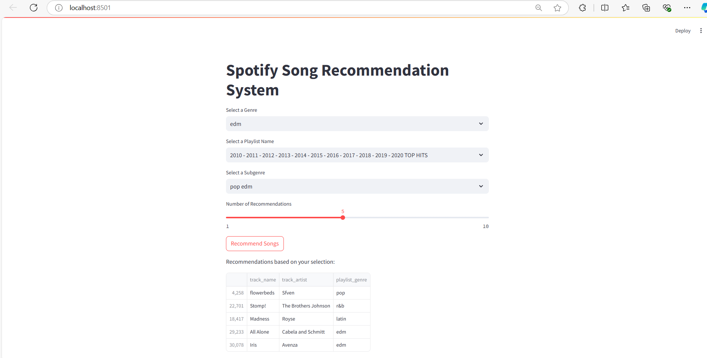

# spotify-music-reccomender

Spotify Music Recommender This repository provides a music recommendation system that uses Spotify's API to suggest personalized songs based on user preferences and listening history. The system offers accurate recommendations using machine learning techniques by analyzing track features like tempo, energy and genre.
Author - Atharva Kailas Harane 
Corizo Minor Project 
Titel - Spotify Songs’ Genre Segmentation

USE below command to run reccomendation model 
streamlit run recommender.py

Project Output Instructions :
•	Perform data pre-processing operations.
•	As a part of data analysis and visualizations draw all the possible plots to provide essential informations and to derive some meaningful     insights.
•	Show your correlation matrix of features according to the datasets.
•	Find out and plot different clusters according to different parameters like playlist genres , playlist names.
•	Build your model and show your final result so that the recommendation system can be built  based on that.

Output:
1) DATA PRE-PROCESSING OPERATIONS

2) Reccomation systems
Recommended songs:
                                              track_name track_artist  \
29684  I Don't Care (with Justin Bieber) - Loud Luxur...   Ed Sheeran   
0      I Don't Care (with Justin Bieber) - Loud Luxur...   Ed Sheeran   
28219                                        Another Day  Holl & Rush   
2371                    The Fox (What Does the Fox Say?)        Ylvis   
19639                                            Todavia  La Factoria   

      playlist_genre  
29684            edm  
0                pop  
28219            edm  
2371             pop  
19639          latin  

